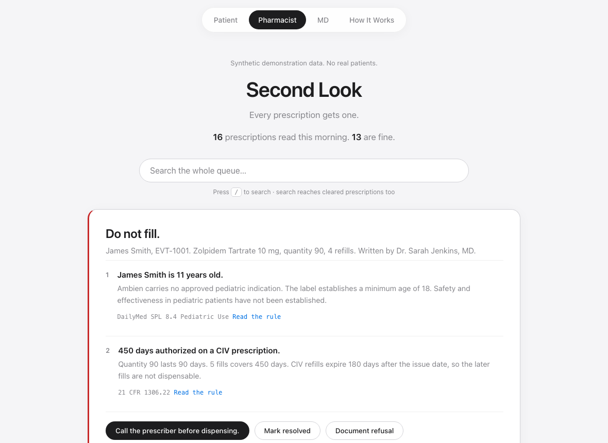
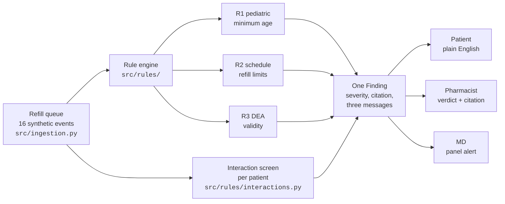
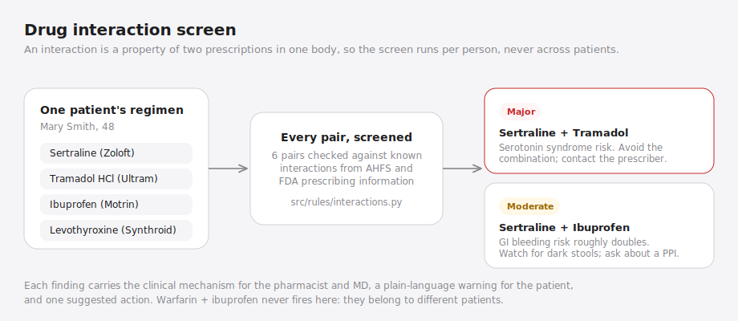

# prescription-event-stream


[](https://prescription-event-stream.vercel.app)

A prescription safety engine. Every simulated refill event is checked on
the server against federal dispensing rules and screened for drug-drug
interactions before it reaches any screen. The same finding renders three
ways: plain English for patients, a verdict with citations for
pharmacists, and panel alerts for prescribers.

**Live app:** https://prescription-event-stream.vercel.app



## The pages

| Page | Who it serves | What it answers |
| --- | --- | --- |
| [`/`](https://prescription-event-stream.vercel.app/) | Patients and parents | Is my family okay, and what do I do today? |
| [`/pharmacist`](https://prescription-event-stream.vercel.app/pharmacist) | Pharmacists | Can I legally fill this, and why not? |
| [`/md`](https://prescription-event-stream.vercel.app/md) | Prescribers | Is anything from my panel being stopped? |
| [`/how-it-works`](https://prescription-event-stream.vercel.app/how-it-works) | Everyone | Architecture, rules, and diagrams |

Every page has live search. Type a drug name, generic or brand, and a
medication card answers what it is approved to treat, its common
off-label uses, its drug class, and how it works in the body. Type a
class like "benzodiazepine" or a mechanism like "dopamine" and the
matching drugs surface. Press `/` to focus search; click any row for
full detail.

## How it works



The server evaluates the queue in `src/transform.py` and serves one JSON
payload from `api/events.py`, a Python serverless function on Vercel.
The three surfaces are static pages with no framework and no build step;
each renders the slice of the payload its reader needs.

## Rule engine

Each rule is one function in `src/rules/` that takes an event and
returns a `Finding` or `None`. A `Finding` carries one message per
audience, so the same object renders on every surface without any rule
knowing which surface is asking.

| Rule | Checks | Severity | Citation |
| --- | --- | --- | --- |
| R1 | Patient age against the label minimum | blocked | DailyMed SPL 8.4 |
| R2 | Refill count and total days supply against the schedule cap | blocked | 21 CFR 1306.12, 1306.22 |
| R3 | DEA registration presence and check digit | blocked | 21 CFR 1301.13, 1306.03 |

On the current synthetic queue the engine reads 16 prescriptions, clears
13, and stops 3:

- **R1 and R2.** James Smith, age 11, holds a 10 mg zolpidem prescription
  written for 90 tablets with 4 refills. No pediatric indication exists,
  and 450 authorized days exceeds the 180 day Schedule IV window.
- **R3.** A Schedule IV tramadol prescription has no DEA registration
  recorded for its prescriber.
- **R3.** A Schedule IV temazepam prescription carries a registration
  that fails the DEA check digit.

The DEA check digit is real arithmetic, not a lookup: the sum of the
first, third, and fifth digits plus twice the sum of the second, fourth,
and sixth must end in the seventh digit. R2 does real dosage math too,
parsing the sig to get doses per day before computing days supply, so
90 tablets taken twice daily is 45 days, not 90.


## Drug interaction screen

The server screens each patient's full regimen for known drug-drug
interactions. The screen runs per person, since an interaction is a
property of two prescriptions in one body, never of the queue. Each
finding carries a severity, the clinical mechanism, a plain-language
version for patients, and a suggested action, sourced from AHFS Drug
Information and FDA prescribing information.

On the current queue it finds three:

| Severity | Pair | Patient | Risk |
| --- | --- | --- | --- |
| Major | Sertraline + Tramadol | Mary Smith | Serotonin syndrome |
| Moderate | Sertraline + Ibuprofen | Mary Smith | GI bleeding |
| Moderate | Omeprazole + Warfarin | Patricia Johnson | Elevated INR |

Warfarin + ibuprofen is a known major interaction but never fires here:
those prescriptions belong to different patients, and a test asserts the
screen never pairs drugs across people.



## Medication knowledge

Every medication answers the questions a patient actually asks:

- **Approved to treat** — FDA-approved indications
- **Common off-label uses** — stated honestly, including "none commonly
  recognized" where that is the truth
- **Drug class** — benzodiazepine, SSRI, statin, ACE inhibitor
- **How it works** — the mechanism in one sentence: raises dopamine and
  norepinephrine, boosts GABA at the GABA-A receptor, blocks histamine H1

All four fields render on the medication card and in row details, and
all four are searchable.

## Design decisions

- **Nothing on any screen is hardcoded.** The clearance line, the stat
  counts, the verdict cards, and the interaction list are all computed
  from the payload. A test asserts `cleared == read - stopped`.
- **Verdict first, evidence second.** The pharmacist surface leads with
  "Do not fill." and numbers its reasons, each with a citation link.
  Red is reserved for blocked; if everything is red, nothing is.
- **One object, three audiences.** Rules produce messages for all three
  surfaces at once, which keeps the surfaces from drifting apart.
- **Data honesty.** The interface once carried a green badge reading
  "SECURE U.S. CLINICAL STREAM." The data is synthetic and the app makes
  no security claim, so the badge is gone. A gray line on every page
  states what the data actually is.
- **No framework.** Four static pages, one shared stylesheet, one shared
  script. The deploy cannot fail on a build because there is no build.

## Quick start

```bash
python3 scripts/serve.py 8099    # static pages + /api/events on :8099
```

```bash
python3 -m unittest discover -s tests    # 33 tests
```

CI runs the full suite on every push. Coverage spans the ingestion and
transform pipeline, all three rules, the clinical math (age, sig
parsing, days supply), the DEA checksum, the interaction screen
including its cross-patient safeguard, and the computed queue summary.

## Project structure

```
api/events.py            Vercel serverless function serving the queue
src/ingestion.py         deterministic synthetic roster, 16 events
src/transform.py         evaluates events, attaches findings and summary
src/rules/               one file per rule + the interaction screen
src/constants/           age floors, schedule limits, interaction pairs
assets/                  shared stylesheet and search/render helpers
index.html, pharmacist/, md/, how-it-works/    the four surfaces
tests/                   unittest suite, run by CI on every push
docs/                    diagrams and screenshots used here
```

## Deployment

Deploys on Vercel with zero configuration: static files from the project
root, `api/*.py` as Python serverless functions. No build step, no
environment variables.
